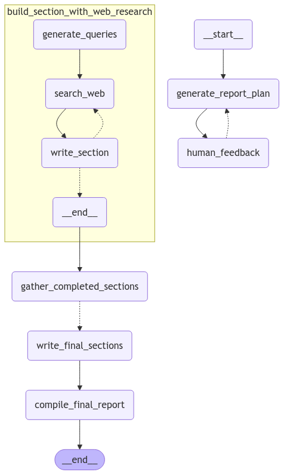

# Deep Research Agent



## Overview

Deep Research Agent is an AI-powered research assistant that automates the process of conducting in-depth research on any topic and generating comprehensive reports. Built with LangGraph and Streamlit, it leverages large language models and web search capabilities to create well-structured, fact-based research documents with minimal human intervention.

## Features

- **Automated Research Planning**: Intelligently plans research approach based on the topic
- **Web Search Integration**: Uses Tavily or Perplexity search APIs to gather relevant information
- **Interactive Feedback**: Allows users to provide feedback on research plans and section drafts
- **Structured Report Generation**: Creates well-organized reports with proper sections and citations
- **Streamlit Interface**: User-friendly web interface for interacting with the research agent
- **LangGraph Workflow**: Sophisticated agent workflow using LangGraph for orchestration

## Architecture

The system uses a graph-based workflow architecture with the following components:

- **Report Planner**: Plans the structure of the research report
- **Query Writer**: Generates effective search queries for web research
- **Web Search**: Retrieves information from the web using search APIs
- **Section Writer**: Drafts content for each section based on research
- **Section Grader**: Evaluates the quality of each section
- **Final Report Compiler**: Assembles the final research document

## Requirements

- Python 3.9+
- Google Gemini API key
- Tavily API key (or Perplexity API key)

## Installation

1. Clone the repository:
   ```bash
   git clone https://github.com/yourusername/deep-research-agent.git
   cd deep-research-agent
   ```

2. Create and activate a virtual environment:
   ```bash
   python -m venv .venv
   source .venv/bin/activate  # On Windows: .venv\Scripts\activate
   ```

3. Install dependencies:
   ```bash
   pip install -r requirements.txt
   ```

4. Create a `.env` file in the root directory with your API keys:
   ```
   GOOGLE_API_KEY=your_google_api_key
   TAVILY_API_KEY=your_tavily_api_key
   ```

## Usage

### Running the Streamlit Interface

Start the Streamlit application:

```bash
streamlit run interface.py
```

This will launch a web interface where you can:
1. Enter a research topic
2. Review and provide feedback on the research plan
3. Monitor the research and writing process
4. View and download the final report

### Using the Agent Programmatically

You can also use the research agent in your Python code:

```python
from report_generator import builder
import asyncio

async def run_research(topic):
    # Create the graph
    graph = builder.build()
    
    # Run the graph with your topic
    result = await graph.ainvoke({"topic": topic})
    
    # Get the final report
    final_report = result["final_report"]
    return final_report

# Example usage
if __name__ == "__main__":
    report = asyncio.run(run_research("Quantum Computing Applications"))
    print(report)
```

## Configuration

You can customize the agent's behavior by modifying the `Configuration` class in `report_generator.py`:

- `report_structure`: Template for the report structure
- `number_of_queries`: Number of search queries per section
- `max_search_depth`: Maximum number of search iterations
- `search_api`: Which search API to use (Tavily or Perplexity)

## Project Structure

- `interface.py`: Streamlit web interface
- `report_generator.py`: Core agent logic and LangGraph workflow
- `prompts.py`: System prompts for the LLM components
- `.env`: Environment variables and API keys
- `requirements.txt`: Python dependencies
- `data/`: Directory for storing research data

## License

[MIT License](LICENSE)